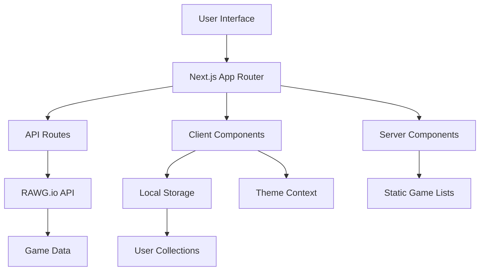

# Design Document

## Overview

The Game Collection Site is a Next.js 15 application built with React 19, utilizing the App Router architecture. The application integrates with the RAWG.io API to provide game data and uses local storage for collection management. The design emphasizes modern UI/UX with Tailwind CSS v4, responsive design, and theme switching capabilities.

## Architecture

### High-Level Architecture



### Technology Stack Integration

- **Next.js 15.4.3** with App Router for routing and server-side rendering
- **React 19.1.0** with Server Components for optimal performance
- **Tailwind CSS v4** for styling with custom theme variables
- **RAWG.io API** for game data fetching
- **Local Storage API** for collection persistence
- **Next.js Image** component for optimized image loading

## Components and Interfaces

### Core Components

#### 1. Layout Components
- `RootLayout` - Main application layout with theme provider
- `Header` - Navigation with search and theme toggle
- `Footer` - Application footer with links

#### 2. Game Components
- `GameGrid` - Responsive grid container for game cards
- `GameCard` - Individual game display card with collection status
- `GameDetail` - Detailed game information page
- `SearchBox` - Game search input with debounced API calls

#### 3. UI Components
- `ThemeToggle` - Dark/light mode switcher
- `LoadingSpinner` - Loading state indicator
- `ErrorBoundary` - Error handling wrapper
- `Pagination` - Navigation for game lists

#### 4. Collection Components
- `CollectionButton` - Add/remove from collection toggle
- `CollectionIndicator` - Visual indicator for collected games

### API Integration Layer

#### RAWG.io API Service
```typescript
interface RAWGService {
  getGames(params: GameListParams): Promise<GameListResponse>
  searchGames(query: string, params?: SearchParams): Promise<GameListResponse>
  getGameDetail(id: number): Promise<GameDetail>
}

interface GameListParams {
  page?: number
  page_size?: number
  ordering?: string
}

interface Game {
  id: number
  name: string
  background_image: string
  released: string
  rating: number
  genres: Genre[]
  platforms: Platform[]
}
```

#### Local Storage Service
```typescript
interface CollectionService {
  addGame(game: Game): void
  removeGame(gameId: number): void
  isInCollection(gameId: number): boolean
  getCollection(): Game[]
  clearCollection(): void
}
```

## Data Models

### Game Data Model
```typescript
interface Game {
  id: number
  name: string
  description?: string
  background_image: string
  released: string
  rating: number
  rating_top: number
  ratings_count: number
  genres: Genre[]
  platforms: Platform[]
  developers: Developer[]
  publishers: Publisher[]
  screenshots?: Screenshot[]
}

interface Genre {
  id: number
  name: string
  slug: string
}

interface Platform {
  platform: {
    id: number
    name: string
    slug: string
  }
}
```

### Application State Model
```typescript
interface AppState {
  games: Game[]
  currentGame: Game | null
  collection: number[] // Array of game IDs
  searchQuery: string
  loading: boolean
  error: string | null
  theme: 'light' | 'dark'
  pagination: {
    current: number
    total: number
    hasNext: boolean
    hasPrev: boolean
  }
}
```

## Error Handling

### Error Types and Handling Strategy

1. **API Errors**
   - Network failures: Show retry mechanism
   - Rate limiting: Display appropriate message with retry timer
   - Invalid responses: Fallback to cached data or error state

2. **Image Loading Errors**
   - Broken images: Replace with placeholder
   - Slow loading: Show skeleton loaders

3. **Local Storage Errors**
   - Storage full: Notify user and provide cleanup options
   - Storage unavailable: Graceful degradation without collection features

### Error Boundary Implementation
```typescript
interface ErrorBoundaryState {
  hasError: boolean
  error: Error | null
  errorInfo: ErrorInfo | null
}
```

## Testing Strategy

### Unit Testing
- Component rendering and props handling
- API service functions and error handling
- Local storage operations
- Theme switching functionality
- Search debouncing logic

### Integration Testing
- API integration with RAWG.io
- Local storage persistence across sessions
- Theme persistence and system preference detection
- Navigation between pages

### End-to-End Testing
- Complete user workflows (search → view → collect)
- Responsive design across device sizes
- Theme switching across all pages
- Collection management workflows

## Performance Considerations

### Optimization Strategies

1. **Image Optimization**
   - Next.js Image component with lazy loading
   - WebP format support with fallbacks
   - Responsive image sizing

2. **API Optimization**
   - Request debouncing for search
   - Caching strategies for game data
   - Pagination for large datasets

3. **Bundle Optimization**
   - Code splitting by routes
   - Dynamic imports for heavy components
   - Tree shaking for unused code

4. **Runtime Performance**
   - React Server Components for static content
   - Client-side hydration optimization
   - Local storage batching for collection updates

## Security Considerations

### API Security
- Environment variable management for API keys
- Rate limiting compliance with RAWG.io
- Input sanitization for search queries

### Client Security
- XSS prevention in dynamic content
- Safe local storage operations
- Content Security Policy headers

## Accessibility

### WCAG Compliance
- Semantic HTML structure
- Keyboard navigation support
- Screen reader compatibility
- Color contrast compliance for both themes
- Focus management for interactive elements

### Implementation Details
- ARIA labels for interactive components
- Alt text for all game images
- Proper heading hierarchy
- Skip navigation links